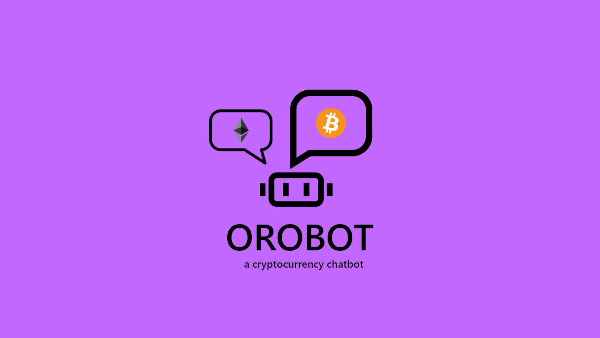

  

### WHAT IS Orobot?

Orobot is a chatbot able to answer various questions about cryptocurrencies and fetch any currency price in realtime.

### Orobot ON MESSENGER

<a href="http://m.me/orobotcrypto" target="_blank">

### SCOPE

1.  Crypto currency prices: Sato recognizes cryptocurrencies symbol ("ETH", "BTC") and fetch their price on [cryptocompare API](https://www.cryptocompare.com/api/) to finally return BTC, USD, and EUR value to the user.
2.  Questions about wallets: online wallets, exchange wallets, cold wallets and hardware wallets.
3.  Questions about the keys: what's they are are and what's their use.
4.  Questions about specific cryptocurrencies (What is BTC?)
5.  Questions about exchanges and trading cryptocurrencies.

